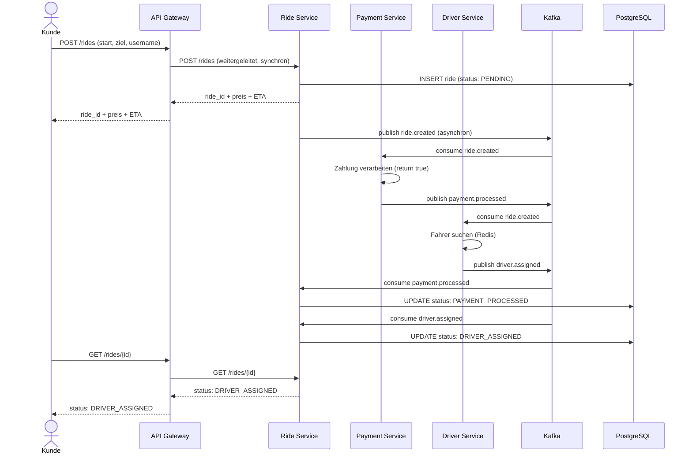
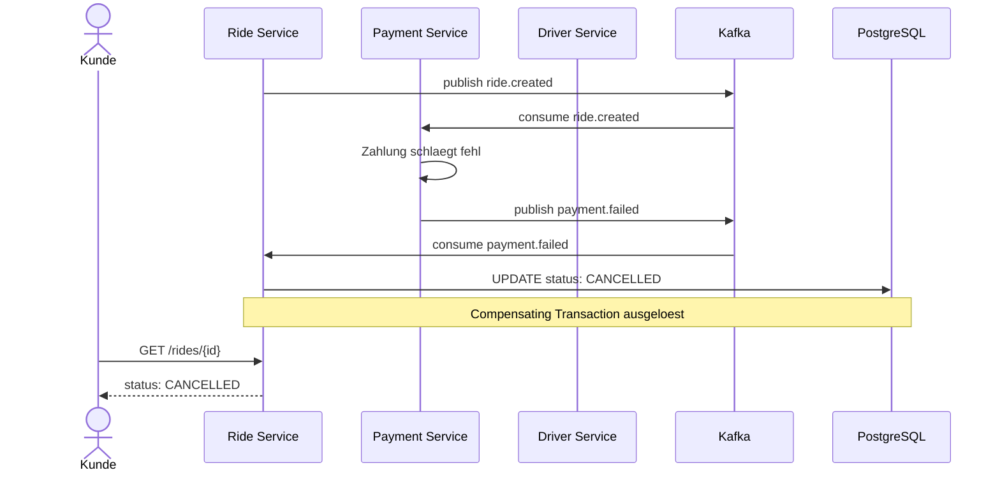
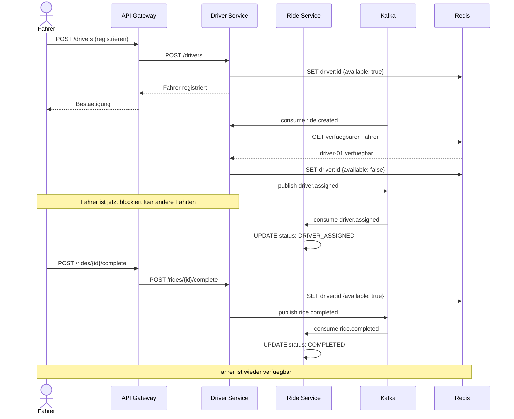

# Smart Mobility Platform

Eine verteilte Ride-Sharing-Plattform (ähnlich wie Uber) als Microservice-Architektur mit Kafka, SAGA-Pattern und Kubernetes-Deployment.

**DHBW Abschlussprojekt · Big Data & Cloud Computing · Gruppe 3**

---

## Inhaltsverzeichnis

1. [Architekturübersicht](#architekturübersicht)
2. [Kommunikations- und Ablaufdiagramme](#kommunikations--und-ablaufdiagramme)
3. [Synchrone Kommunikation](#synchrone-kommunikation)
4. [Asynchrone Kommunikation](#asynchrone-kommunikation)
5. [SAGA-Pattern](#saga-pattern)
6. [Containerisierung – Dockerfile](#containerisierung--dockerfile)
7. [Kubernetes Deployment](#kubernetes-deployment)
8. [Zero-Downtime Rolling Update](#zero-downtime-rolling-update)
9. [Big Data Analytics – Spark](#big-data-analytics--spark)
10. [Lokale Entwicklung](#lokale-entwicklung)
11. [Typischer Ablauf](#typischer-ablauf)
12. [Vereinfachungen](#vereinfachungen)
13. [Abgabe-Checkliste](#abgabe-checkliste)

---

## Architekturübersicht

### Diagramm mit Microservices, Aggregates und Aufgaben

```
Customer / Driver
       │
       ▼ REST (synchron)
  API Gateway :8000
       │
       ├──► Ride Service    :8001  (PostgreSQL)   – Fahrten, SAGA-Orchestrierung
       ├──► Driver Service  :8002  (Redis)         – Fahrerverwaltung, Verfügbarkeit
       ├──► Payment Service :8003  (In-Memory)     – Zahlungsabwicklung (simuliert)
       └──► Analytics       :8004  (MongoDB+Spark) – Batch KPI-Berechnung

Alle Services kommunizieren asynchron über Kafka (Event-Streaming)
```

### Microservices Übersicht

| Service | Port | Datenbank | Aufgabe |
|---|---|---|---|
| API Gateway | 8000 | – | Einziger Eintrittspunkt, leitet alle Requests synchron weiter |
| Ride Service | 8001 | PostgreSQL | Fahrten buchen, SAGA orchestrieren, Positionen tracken |
| Driver Service | 8002 | Redis | Fahrerverwaltung, Verfügbarkeit, Fahrerzuweisung |
| Payment Service | 8003 | In-Memory | Zahlungsabwicklung (simuliert mit return true) |
| Analytics Service | 8004 | MongoDB | Spark Batch Job, periodische KPI-Berechnung |
| Frontend | 3000 | – | Dashboard (Vanilla HTML/JS) |

---

## Kommunikations- und Ablaufdiagramme

### User Story 1 – Fahrt buchen (Happy Path)



### User Story 1 – Fehlerfall (Compensating Transaction)



### User Story 2 – Fahrer Flow



---

## Synchrone Kommunikation

**Zwischen: Client → API Gateway → Microservices (REST)**

Das System nutzt synchrone REST-Kommunikation als einzigen Eintrittspunkt für alle Clients. Der API Gateway leitet jeden Request direkt an den zuständigen Service weiter und gibt die Antwort synchron zurück.

```
Beispiel: Fahrt buchen

Kunde ──POST /rides──► API Gateway ──POST /rides──► Ride Service
                                                          │
                                                     PostgreSQL
                                                          │
Kunde ◄──ride_id + preis + ETA──── API Gateway ◄──────────┘
```

**Vorteil:** Einfach zu implementieren, sofortige Antwort, leicht zu debuggen.  
**Nachteil:** Fester Kopplung zwischen Gateway und Services – fällt ein Service aus, schlägt der Request fehl.

---

## Asynchrone Kommunikation

**Zwischen: Ride Service → Kafka → Payment Service & Driver Service**

Nach dem Anlegen einer Fahrt publiziert der Ride Service das Event `ride.created` auf Kafka. Payment Service und Driver Service konsumieren dieses Event unabhängig voneinander und in ihrem eigenen Tempo.

```
Beispiel: SAGA nach Fahrtbuchung

Ride Service ──publish──► [Kafka: ride.created] ──consume──► Payment Service
                                                 ──consume──► Driver Service
```

**Vorteil:** Vollständige Entkopplung der Services – ein Service kann ausfallen ohne andere zu blockieren. Nachrichten bleiben in Kafka bis sie verarbeitet werden.  
**Nachteil:** Komplexere Fehlerbehandlung, schwerer zu debuggen, kein sofortiges Feedback.

### Alle Kafka Topics

| Topic | Publisher | Subscriber |
|---|---|---|
| `ride.created` | Ride Service | Payment Service, Driver Service |
| `payment.processed` | Payment Service | Ride Service |
| `payment.failed` | Payment Service | Ride Service |
| `driver.assigned` | Driver Service | Ride Service |
| `driver.not_found` | Driver Service | Ride Service |
| `ride.completed` | Driver Service | Ride Service |
| `ride.cancelled` | Ride Service | Payment Service, Driver Service |
| `location.updated` | Ride Service | (Frontend polling) |

---

## SAGA-Pattern

Die Fahrtbuchung ist eine verteilte Transaktion über 3 Services und 3 Schritte.

### Happy Path

```
Schritt 1:  Ride Service    → speichert Fahrt (PENDING)
                            → publiziert ride.created

Schritt 2:  Payment Service → verarbeitet Zahlung (return true)
                            → publiziert payment.processed ✅

Schritt 3:  Driver Service  → weist verfuegbaren Fahrer zu
                            → publiziert driver.assigned ✅

Ergebnis: Fahrt Status → DRIVER_ASSIGNED
```

### Compensating Transactions (Fehlerfall)

| Fehler | Auslöser | Kompensation |
|---|---|---|
| `payment.failed` | Payment Service | Ride Service → Status: CANCELLED |
| `driver.not_found` | Driver Service | Ride Service → Status: CANCELLED + Payment Service → Status: REFUNDED |
| `ride.cancelled` | Ride Service | Payment Service → Status: REFUNDED |

**Schlüsselprinzip:** Jeder Schritt der SAGA kann durch eine Compensating Transaction rückgängig gemacht werden. So wird die Datenkonsistenz über alle Services hinweg sichergestellt, ohne eine gemeinsame Datenbank zu benötigen.

---

## Containerisierung – Dockerfile

Jeder Service hat ein eigenes Dockerfile. Beispiel: [ride-service/Dockerfile](./ride-service/Dockerfile)

```dockerfile
FROM python:3.11-slim

WORKDIR /app

COPY requirements.txt .
RUN pip install --no-cache-dir -r requirements.txt

COPY app/ ./app/

RUN adduser --disabled-password --gecos "" appuser
RUN chown -R appuser:appuser /app
USER appuser

EXPOSE 8001

CMD ["uvicorn", "app.main:app", "--host", "0.0.0.0", "--port", "8001"]
```

Alle Dockerfiles befinden sich in den jeweiligen Service-Ordnern:
- [ride-service/Dockerfile](./ride-service/Dockerfile)
- [driver-service/Dockerfile](./driver-service/Dockerfile)
- [payment-service/Dockerfile](./payment-service/Dockerfile)
- [api-gateway/Dockerfile](./api-gateway/Dockerfile)
- [analytics-service/Dockerfile](./analytics-service/Dockerfile)
- [frontend/Dockerfile](./frontend/Dockerfile)

---

## Kubernetes Deployment

Alle Kubernetes-Manifeste befinden sich im Ordner [k8s/](./k8s/).

### Datenbank als eigenes Deployment

PostgreSQL läuft als eigenes Kubernetes Deployment mit Persistent Volume – siehe [k8s/02-postgres.yaml](./k8s/02-postgres.yaml).

Gleiches gilt für Redis ([k8s/03-redis.yaml](./k8s/03-redis.yaml)) und MongoDB ([k8s/04-mongodb.yaml](./k8s/04-mongodb.yaml)).

### Deployment auf den Uni-Cluster

```bash
# Kubeconfig einrichten (nur im Uni-VPN erreichbar)
cp gruppe-3-kubeconfig.yaml ~/.kube/config
kubectl get nodes

# Alles deployen
kubectl apply -f k8s/

# Status prüfen
kubectl get deployments
kubectl get pods
kubectl get services
```

### kubectl get deployments

> 📸 **Screenshot folgt nach Cluster-Deployment**

```
NAME                READY   UP-TO-DATE   AVAILABLE
ride-service        2/2     2            2
driver-service      2/2     2            2
payment-service     2/2     2            2
api-gateway         2/2     2            2
analytics-service   1/1     1            1
frontend            1/1     1            1
postgres            1/1     1            1
redis               1/1     1            1
mongodb             1/1     1            1
```

### kubectl get pods

> 📸 **Screenshot folgt nach Cluster-Deployment**

### kubectl get services

> 📸 **Screenshot folgt nach Cluster-Deployment**

---

## Zero-Downtime Rolling Update

Der Ride Service ist mit Rolling Update konfiguriert – siehe [k8s/05-ride-service.yaml](./k8s/05-ride-service.yaml).

```yaml
strategy:
  type: RollingUpdate
  rollingUpdate:
    maxSurge: 1        # 1 extra Pod darf waehrend Update laufen
    maxUnavailable: 0  # 0 Pods duerfen ausfallen → immer mind. 2 aktiv
```

**Funktionsprinzip:** Kubernetes startet einen neuen Pod mit der neuen Version, wartet bis er den Health-Check besteht, und stoppt erst dann einen alten Pod. So sind während des gesamten Updates mindestens 2 Pods aktiv – kein Nutzer merkt etwas.

### Screen-Recording

> 📹 **Screen-Recording folgt nach Cluster-Deployment** – siehe [assets/rolling-update-demo.mp4](./assets/rolling-update-demo.mp4)

### Manuell durchführen

```bash
# Neues Image deployen
kubectl set image deployment/ride-service ride-service=ride-service:v2

# Update-Fortschritt beobachten
kubectl rollout status deployment/ride-service

# Bei Problemen: Rollback
kubectl rollout undo deployment/ride-service
```

---

## Big Data Analytics – Spark

### Datenquelle

Der Spark Batch Job liest historische Fahrtdaten aus **MongoDB** (Collection: `rides`) oder alternativ direkt aus dem Kafka Topic `ride.created`.

Quellcode: [analytics-service/app/spark_job.py](./analytics-service/app/spark_job.py)

### Spark Batch Job – wichtigste Berechnungen

```python
# Status-Verteilung
status_counts = df.groupBy("status").count().collect()

# Aggregationen
agg_row = df.agg(
    F.round(F.avg("price_eur"),   2).alias("avg_price"),
    F.round(F.avg("distance_km"), 2).alias("avg_distance"),
    F.round(F.avg("eta_minutes"), 2).alias("avg_eta"),
).collect()[0]

# Umsatz (nur abgeschlossene Fahrten)
revenue = df.filter(F.col("status") == "COMPLETED") \
            .agg(F.round(F.sum("price_eur"), 2)) \
            .collect()[0]

# Top 5 Nutzer
top_users = df.groupBy("username") \
              .count() \
              .orderBy(F.desc("count")) \
              .limit(5) \
              .collect()
```

### Spark Job manuell triggern

```bash
# Über die Swagger UI
http://localhost:8004/docs → POST /analytics/trigger

# Oder per curl
curl -X POST http://localhost:8004/analytics/trigger?source=mongo
```

### Spark Job Logs

> 📸 **Screenshot der Spark-Job Logs folgt**

```
sm-analytics-service | INFO: Starting Spark batch job | source=mongo | window=24h
sm-analytics-service | INFO: Loaded N rides from MongoDB
sm-analytics-service | INFO: KPIs computed: {...}
sm-analytics-service | INFO: KPI result saved to MongoDB: <doc_id>
sm-analytics-service | INFO: Spark session stopped
```

### Ergebnisse in MongoDB (NoSQL)

Die berechneten KPIs werden in MongoDB gespeichert:
- Datenbank: `analytics`
- Collection: `kpi_results`

> 📸 **Screenshot der MongoDB Ergebnisse folgt**

Beispiel-Dokument:
```json
{
  "_id": "...",
  "computed_at": "2026-04-16T10:00:00",
  "window_hours": 24,
  "kpis": {
    "total_rides": 10,
    "completed_rides": 8,
    "cancelled_rides": 2,
    "completion_rate_pct": 80.0,
    "avg_price_eur": 12.50,
    "avg_distance_km": 5.0,
    "avg_eta_minutes": 7.5,
    "revenue_eur": 100.0,
    "top_users": [
      {"username": "alice", "ride_count": 3},
      {"username": "bob",   "ride_count": 2}
    ]
  }
}
```

---

## Lokale Entwicklung

### Voraussetzungen

- Docker Desktop installiert und gestartet
- Python 3.11+
- kubectl installiert

### Alles starten mit docker-compose

```bash
cd smart-mobility
docker-compose up --build
```

Danach verfügbare URLs:

| URL | Beschreibung |
|---|---|
| http://localhost:3000 | Frontend Dashboard |
| http://localhost:8000/docs | API Gateway Swagger UI |
| http://localhost:8001/docs | Ride Service Swagger UI |
| http://localhost:8002/docs | Driver Service Swagger UI |
| http://localhost:8003/docs | Payment Service Swagger UI |
| http://localhost:8004/docs | Analytics Service Swagger UI |
| http://localhost:8080 | Kafka UI |

---

## Typischer Ablauf

```bash
# 1. Fahrer registrieren
curl -X POST http://localhost:8000/drivers \
  -H "Content-Type: application/json" \
  -d '{"driver_id": "driver-01", "name": "Max Mustermann"}'

# 2. Fahrt buchen
curl -X POST http://localhost:8000/rides \
  -H "Content-Type: application/json" \
  -d '{
    "username": "alice",
    "start_lat": 48.1351, "start_lon": 11.5820,
    "end_lat":   48.1900, "end_lon":   11.6200
  }'

# 3. Status abfragen
curl http://localhost:8000/rides/{RIDE_ID}

# 4. Fahrt abschliessen
curl -X POST http://localhost:8000/drivers/rides/{RIDE_ID}/complete \
  -H "Content-Type: application/json" \
  -d '{"driver_id": "driver-01"}'

# 5. Zahlung pruefen
curl http://localhost:8000/payments/{RIDE_ID}
```

### SAGA Fehlerfall testen

```bash
# In payment-service/.env setzen:
SIMULATE_FAILURE_RATE=0.8
# Dann Ride buchen → 80% schlagen fehl → Status: CANCELLED
```

---

## Ordnerstruktur

```
smart-mobility/
├── docker-compose.yml
├── README.md
├── assets/                          ← Screenshots & Screen-Recordings
│   └── rolling-update-demo.mp4
├── k8s/
│   ├── 00-configmap.yaml
│   ├── 01-secrets.yaml
│   ├── 02-postgres.yaml             ← Datenbank als eigenes Deployment
│   ├── 03-redis.yaml
│   ├── 04-mongodb.yaml
│   ├── 05-ride-service.yaml         ← Rolling Update konfiguriert
│   ├── 06-driver-service.yaml
│   ├── 07-payment-service.yaml
│   ├── 08-api-gateway.yaml
│   ├── 09-analytics-service.yaml
│   ├── 10-frontend.yaml
│   ├── 11-ingress.yaml
│   └── rolling-update-demo.sh
├── ride-service/
│   ├── Dockerfile
│   ├── requirements.txt
│   └── app/
├── driver-service/
│   ├── Dockerfile
│   ├── requirements.txt
│   └── app/
├── payment-service/
│   ├── Dockerfile
│   ├── requirements.txt
│   └── app/
├── api-gateway/
│   ├── Dockerfile
│   ├── requirements.txt
│   └── app/
├── analytics-service/
│   ├── Dockerfile
│   ├── requirements.txt
│   └── app/
│       └── spark_job.py             ← Spark Batch Job
└── frontend/
    ├── Dockerfile
    ├── index.html
    └── nginx.conf
```

---

## Vereinfachungen

- Keine echte Authentifizierung – Benutzername als Query-Parameter
- Fahrzeit/Preis via Haversine-Formel (Luftlinie) + konstanter Geschwindigkeit (40 km/h)
- Bezahlung simuliert (`return true`) – vollständig in SAGA eingebunden
- Nur die geforderten SAGA-Fehlerfälle implementiert

---

## Abgabe-Checkliste

- [x] Microservice-Zerlegung (5 Services + Gateway + Frontend)
- [x] Synchrone Kommunikation (REST via API Gateway)
- [x] Asynchrone Kommunikation (Kafka Event Streaming)
- [x] SAGA-Transaktion mit 3 Schritten + Compensating Transactions
- [x] Kommunikations-/Ablaufdiagramme für User Story 1 und 2
- [x] Dockerfile für jeden Microservice
- [x] Kubernetes Manifeste (alle in `k8s/`)
- [x] Datenbank als eigenes Deployment (PostgreSQL, Redis, MongoDB)
- [x] Zero-Downtime Rolling Update (ride-service)
- [x] Spark Batch Job für Analytics
- [x] Ergebnisse in NoSQL (MongoDB) gespeichert
- [ ] kubectl Screenshots nach Cluster-Deployment einfügen
- [ ] Screen-Recording Rolling Update in `assets/` ablegen
- [ ] Spark Log Screenshot einfügen
- [ ] MongoDB Ergebnis Screenshot einfügen
- [ ] GitHub Repository finalisieren
- [ ] ZIP für Moodle-Abgabe erstellen (Deadline: Mo 20.04. 9 Uhr)
